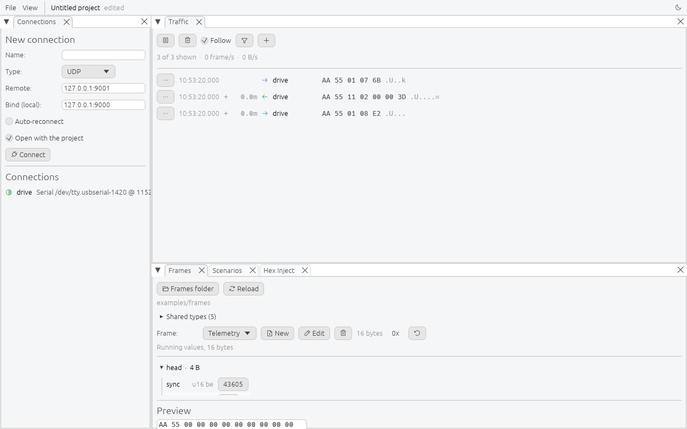

# Protocol Simulator

A generic simulator for the protocols you invent yourself. Describe your frames
field by field, assemble them into complete simulation scenarios, and run the
whole exchange over RS, UDP or TCP.



## Install

Prebuilt binaries for Linux, macOS and Windows are on the
[releases page][releases]. From source:

```sh
cargo run -p sim-gui                       # empty
cargo run -p sim-gui -- examples/frames    # open a frames folder
cargo run -p sim-gui -- my-project.toml    # open a project
```

One positional argument is accepted. A directory is taken as a frames folder, a
file as a project.

A terminal front end covers the same engine for a board with no display:

```sh
cargo run -p sim-tui                       # empty
cargo run -p sim-tui -- examples/frames    # open a frames folder
```

A prebuilt aarch64 Linux binary is also on the [releases page][releases]. To
build it yourself, `make tui-embedded` cross-compiles it from macOS or Linux,
needing `cargo install cargo-zigbuild` and `zig` on the `PATH` once (`brew
install zig`, `apt install zig`, or `pip install ziglang`). The result is a
static musl binary, so nothing on the board has to match it:

```sh
make tui-embedded
scp target/aarch64-unknown-linux-musl/release/protocol-simulator-tui root@board:/tmp/
```

`--run` skips the screen and runs one scenario from a project, exiting once it
completes, for a service started at boot rather than a person at a keyboard:

```sh
protocol-simulator-tui project.toml --run "Heartbeat 10 Hz"
```

## Concepts

| Term | Is |
| --- | --- |
| Connection | a named transport endpoint. Everything else refers to it by name |
| Frame | a named sequence of typed fields, one TOML file |
| Type | a group of fields, or a narrowed scalar, shared across a folder |
| Scenario | an ordered list of steps run against one or more connections |
| Project | one TOML file recording all of the above, plus the window layout |

## Documentation

| Page | Covers |
| --- | --- |
| [Connections](docs/connections.md) | transports, retry, diagnosing failures |
| [Sending frames](docs/frames.md) | the Frames panel, encoding and decoding |
| [Building frames](docs/frame-editor.md) | the editor, shared types, what it refuses |
| [Scenarios](docs/scenarios.md) | steps, matching, repeats |
| [Watching traffic](docs/traffic.md) | the monitor, filters, decoding a captured frame |
| [Projects](docs/projects.md) | the project file and what it holds |
| [Frame file format](examples/frames/README.md) | reference, one example per feature |

## Architecture

Three crates.

`sim-core` holds the engine, the frame model, the codec and the file formats,
with no GUI dependency. The engine runs on a dedicated thread with a Tokio
runtime and one task per connection, and speaks to the front end over two `mpsc`
channels carrying `Command` and `Event`.

`sim-session` holds what a front end needs that is not drawing: the loaded
libraries, the traffic buffer and its filters, the unsaved drafts, and the one
door to the engine.

`sim-gui` draws the panels with `egui` and `egui_dock`. It owns no protocol
logic.

[docs/architecture.md](docs/architecture.md) has the module map, the engine
contract and the seams.

## Development

[CLAUDE.md](CLAUDE.md) has the conventions and
[docs/testing.md](docs/testing.md) has the test layout.

```sh
make ci                 # fmt, clippy -D warnings, tests
make third-party        # regenerate THIRD-PARTY.md after a dependency change
make third-party-check  # fail if it is stale
```

Screenshots are rendered from the panels themselves rather than captured, so
they cannot drift out of date:

```sh
cargo test -p sim-gui --features shots shots
```

## License

MIT or Apache-2.0, at your option. See [LICENSE-MIT](LICENSE-MIT) and
[LICENSE-APACHE](LICENSE-APACHE). Contributions are taken under the same terms.

[THIRD-PARTY.md](THIRD-PARTY.md) lists every crate compiled in, grouped by
licence, with the full text of each. One of them, `serialport`, is MPL-2.0,
which is file level copyleft and reaches nothing here.

[releases]: https://github.com/tdameros/protocol-simulator/releases
