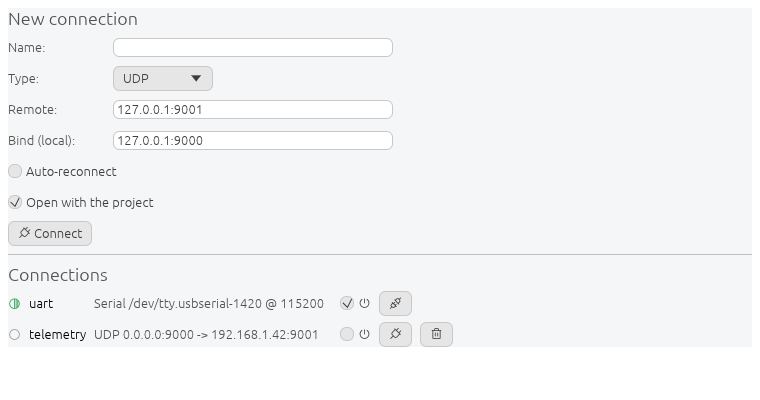

# Connections

A connection is a named transport endpoint. Frames, scenarios and monitors all
refer to it by that name.

## Transports

| Type | Fields | Notes |
| --- | --- | --- |
| UDP | `bind`, `remote` | binds immediately, no handshake |
| UDP multicast | `group`, `interface` | binds `0.0.0.0:<group port>` |
| TCP client | `remote` | dials on connect |
| TCP server | `bind` | one peer at a time, goes back to accepting when it hangs up |
| Serial | `port_name`, `baud_rate`, `data_bits`, `parity`, `stop_bits`, `flow_control` | |

Multicast binds the wildcard address rather than the group. Binding a multicast
address directly is rejected on Windows, and the port is fixed by the group.

## States

| State | Means |
| --- | --- |
| Disconnected | no socket open. A failure lands here, with the reason on the row |
| Connecting | dialling, or waiting out a retry delay |
| Listening | TCP server bound, no peer yet |
| Connected | traffic can flow |

`Listening` is kept apart from the other two on purpose. There is nowhere to
send yet, so it is not `Connected`, and the port is already open, so a server
reporting `Connecting` would look broken when it is working.

## Options

**Auto-reconnect** attaches a retry policy. The default doubles from 500 ms to a
ceiling of 10 s and keeps trying until the connection is disconnected by hand. A
manual reconnect reuses the policy the connection was made with.

**Open with the project** reconnects it when the project is loaded.

## Row controls

Left to right: state dot, name, transport summary, open with the project,
connect or disconnect, delete. Deleting a connection that is open closes it
first.

## Failures

Reasons are reported verbatim from the operating system, on the row and in the
status bar.

| Message | Cause |
| --- | --- |
| `Address already in use` | another process holds the port, often a second copy of this app |
| `Permission denied` on a serial port | the user is not in `dialout` on Linux |
| `No such file or directory` on a serial port | wrong device name |
| `Connection refused` | nothing is listening at the TCP remote |

Serial device names are `/dev/tty.usbserial*` on macOS, `/dev/ttyUSB*` or
`/dev/ttyACM*` on Linux, `COM*` on Windows.

UDP has no connect step. A UDP connection that binds reports Connected whether
or not anything is at the other end. If nothing arrives, check that `bind` is an
address the sender can reach rather than `127.0.0.1`.
