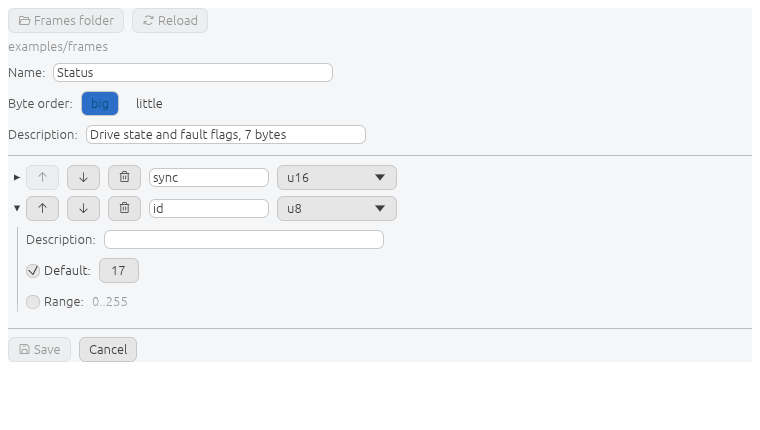
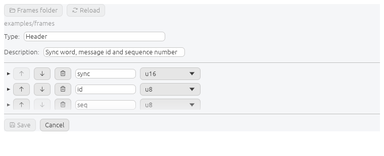

# Building frames

The editor writes the same TOML a developer would write by hand, back into the
same file.

## Frame level

| Setting | Notes |
| --- | --- |
| Name | what scenarios refer to. Renaming moves the file to match |
| Byte order | inherited by every field that does not override it |
| Description | shown under the picker |

Changing the frame's byte order moves the fields that were following it and
leaves the ones that had an order of their own.

## Field rows

Each row carries move up, move down, delete, the name, and the kind. The body
holds what depends on the kind.

| Kind | Body |
| --- | --- |
| `u8` … `f64` | byte order, optional default, optional range |
| `bytes`, `text` | length in bytes |
| `enum` | variant names and values, listed by value |
| `bits` | sub-field names and widths, with the running total against `repr` |
| `xor8`, `sum8/16/32`, `crc*` | the two ends of the range it covers |

Both ends of a checksum range are picked from the fields before it. The range is
held by name, so inserting a field inside it keeps it covered.

## Shared types

Types live in `types/` inside the frames folder, one per file, and every frame
in the folder can name them.

Reach one from **Edit** in the body of a field that uses it, or from the folded
**Shared types** row. A field's kind picker lists them after the builtins and
offers **New type...**, which creates one and assigns it to that field on save.

A field written as a type takes a multiplicity:

| Setting | Produces |
| --- | --- |
| one | `head.sync`, `head.id`, `head.seq` |
| counted, 4 | `motor[0].rpm`, `motor[1].rpm`, … |
| named, `left` `right` | `axle.left.rpm`, `axle.right.rpm` |

### Propagation

Editing a type reaches every frame naming it. The impact is listed beside Save
before the change is written, one line per frame, as broken, resized or
reshaped.

| Action | Effect on the frames using it |
| --- | --- |
| edit fields | they change with it, which is the point |
| rename | the new name is written into all of them |
| delete | the type is written out in full wherever it was used, bytes unchanged |

Rename and delete are all or nothing. Nothing is written until every frame the
change reaches has been re-read and found to encode the same bytes.

## Refusals

Save is disabled and the reason is shown beside it whenever the result could not
be read back as the same frame.

| Reason | Cause |
| --- | --- |
| `a field needs a name` | a name box is empty |
| `<name> cannot be written the way this file states it` | the file states the field through a named type, which owns its range and representation |
| `<name> needs at least one field` | an empty group type |
| `a frame named "<x>" already exists` | the name is taken in this folder |
| `<file> already holds <x>` | two names reduce to the same file name |

Two fields of one name, and a checksum left with nothing to cover, are refused
as you type rather than at save time.

## Writing

Saving rewrites the origin file key by key. Comments, blank lines, key order and
line endings survive. A factorisation is never flattened: a frame written as
three declarations that expand to sixteen fields is written back as three.

Byte order, named types, and the range and representation those types carry are
never overwritten from the model. The file keeps the last word on them.
