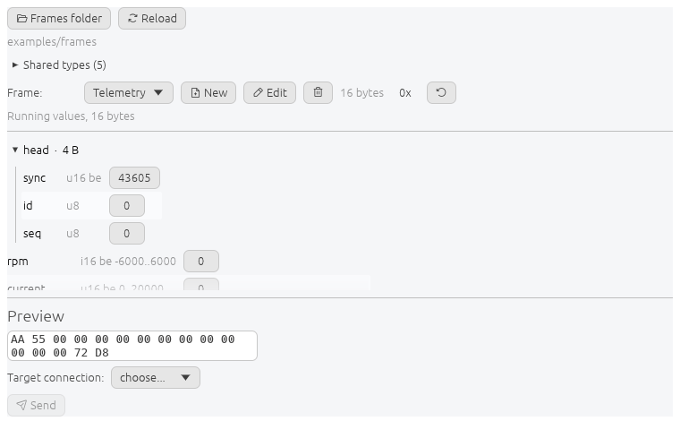

# Sending frames

The Frames panel encodes a definition into bytes and sends them, and decodes
bytes back into fields.

## Controls

| Control | Does |
| --- | --- |
| Frames folder | choose the folder holding the `.toml` definitions |
| Reload | re-read every file, picking up edits made outside the app |
| Shared types | folded. See [building frames](frame-editor.md) |
| Frame | pick one. New, Edit and Delete act on it |
| N bytes | encoded size of the current frame |
| 0x | show whole number fields in hexadecimal |
| Reset | put every field back to its default |
| Preview | the encoded bytes, recomputed on every change |
| Target connection, Send | where the bytes go |

## Field widgets

| Field kind | Widget |
| --- | --- |
| integer, float | drag box, accepts decimal, `0x`, `0b`, `0o`, and `_` separators |
| `enum` | dropdown of the variant names |
| `bits` | one checkbox per sub-field, labelled with the bit positions it occupies |
| `bytes`, `text` | text box |
| checksum | read only, computed at encode time |
| field of a shared type | folded, its expansion listed underneath and read only |

A field carrying a `range` refuses values outside it. The range is shown next to
the type.

## Decoding

Bytes pasted into the preview box are decoded into the fields of the frame
currently picked. A checksum that does not match is reported rather than
recomputed.

The traffic monitor sends bytes here with **Open in Frames** on a row.

## Values

Field values are held per frame name and survive switching frames. They are
saved in the [project](projects.md).

After a Reload, a value that still fits its field is kept and anything else
falls back to the field's default.

## Errors

| Message | Cause |
| --- | --- |
| `<file>: <reason>` under the picker | that file failed to load, the others still did |
| `No .toml frame definition in that folder` | the folder loaded and held none |
| a range error on Send | a value is outside what the field allows |

## File format

One frame per file, TOML, in a folder of your choosing. Full reference with an
example per feature: [`examples/frames/README.md`](../examples/frames/README.md).
