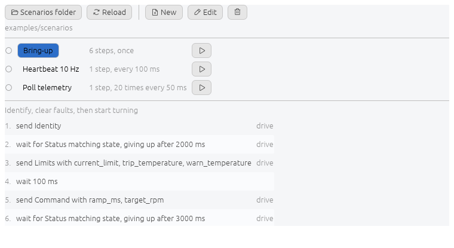

# Scenarios

A scenario is an ordered list of steps run against one or more connections.



## Running

Pick one and press play. The row shows the current step and pass. Play becomes
stop.

A scenario that names a connection the project does not have reports it and does
not start.

## From the command line

The terminal front end's `--run` runs one scenario with no screen, printing
what happens and exiting once it ends:

```sh
protocol-simulator-tui project.toml --run "Heartbeat 10 Hz"
```

Connections marked autoconnect are opened first. The exit code is 0 once the
scenario completed, 1 for anything else, including a name `--run` does not
find. A scenario with no `times` runs until the process is stopped, which for
a service started at boot is `SIGTERM`, the same as any other.

## Steps

| Step | Key | Carries |
| --- | --- | --- |
| send a frame | `send` | `with`, values overriding the defaults, `counters`, and `from_capture` |
| send raw bytes | `raw` | a hex string |
| wait | `wait_ms` | a delay in milliseconds |
| wait for | `wait_for` | a frame, its expected values and what to capture, or a hex pattern, plus `timeout_ms` |

`wait_for` takes one of two shapes:

```toml
wait_for = { frame = "Status", match = { state = 2 }, timeout_ms = 500 }
wait_for = { hex = "AA 55 ?? 01", at = 0, timeout_ms = 500 }
```

Naming a frame is resolved against the definition when the scenario starts, so
editing the frame afterwards leaves the wait meaning the same thing. Fields left
out of `match` are unconstrained. `??` in a hex pattern matches any byte, and
`at` pins it to a byte offset. The two shapes are exclusive, and a wait needs
one of them.

## Captures

A field a `wait_for` reads back can be remembered under a name of its own, for
a later step to send on, on any connection.

```toml
[[scenario.step]]
send = "Request"
on = "server1"

[[scenario.step]]
wait_for = { frame = "Response", capture = { code = "server1_code" } }
on = "server1"

[[scenario.step]]
send = "Forward"
on = "server2"
from_capture = { payload = "server1_code" }
```

`capture` names, on the left, a field of the frame being waited for. On the
right is the variable it becomes. `from_capture` on a later `send` step names,
on the left, one of that frame's own fields, filled with whatever the variable
on the right last held.

A capture needs a frame to decode by, so it is refused on a hex pattern wait.
It also needs one target, an answer from a second one having nothing to do
with the first. `from_capture` is refused where it names a variable no earlier
step captures, caught when the scenario loads rather than partway through a
run. A variable is remembered for one pass and is gone before the next repeat
starts, so a step reading it always reads what this pass captured.

## Targets

`on` at the scenario level applies to every step. A step may carry its own `on`
to override it. A `wait_ms` step has no targets.

```toml
on = "drive"
on = ["drive", "gateway"]
```

## Repeats

```toml
repeat = { every_ms = 100 }             # until stopped
repeat = { every_ms = 100, times = 10 } # ten passes
```

The period is the interval between starts. A pass that overruns does not queue a
catch up burst, the next tick is skipped.

## Counters

A counter replaces a field value with one that steps every pass.

```toml
counters = { seq = { wrap = 255 } }
counters = { "head.seq" = { from = 1, step = 2, wrap = 255 } }
```

`from` defaults to 0, `step` to 1. `wrap` is inclusive, so a byte counter comes
back to `from` after 255. The editor offers a fixed value or a counter for a
field, not both.

## Editing

New and Edit open the step editor. Connections are checkboxes, frames and field
names come from what is loaded, and values use the same widgets as the Frames
panel.

Save is refused when the result could not be read back, with the reason shown.
An empty name, a step with no bytes, a wait matching on nothing, a scenario with
no steps.

## File format

Several scenarios to a file, in a folder of your choosing.

```toml
[[scenario]]
name = "Heartbeat 10 Hz"
description = "Keeps the drive from timing out"
on = "drive"
repeat = { every_ms = 100 }

[[scenario.step]]
send = "Heartbeat"
counters = { seq = { wrap = 255 } }
```

Two worked examples ship in [`examples/scenarios`](../examples/scenarios).
Saving from the app rewrites the origin file and leaves its comments alone.
