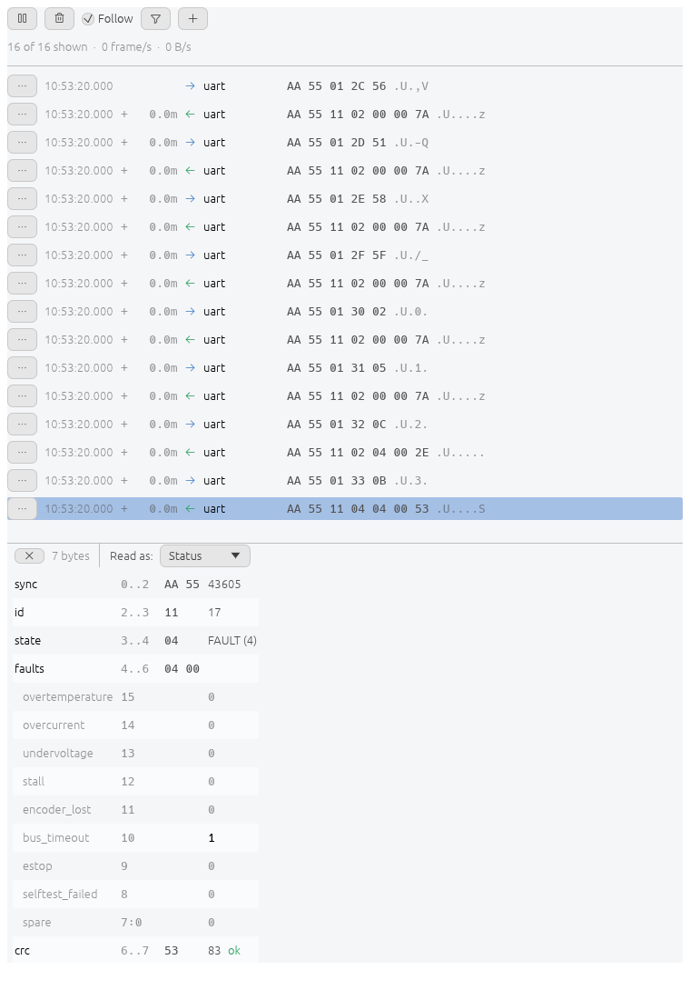
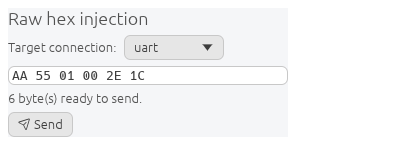

# Watching traffic

Every frame sent and received, on every connection, in one buffer.

A row carries the timestamp, the gap since the previous frame, the direction,
the connection, the bytes, and their printable characters.

The header shows how many rows pass the filter out of how many are held, with
the current rate in frames and bytes per second.

The buffer holds the last 10 000 frames. Older ones are dropped.

## Controls

| Control | Does |
| --- | --- |
| Pause | freezes the view. Capture continues |
| Clear | hides everything logged so far. Capture continues |
| Follow | keeps the newest row in view |
| Filter | connections, direction, and a hex pattern the frame must contain |
| + | opens another monitor over the same buffer |

Several monitors can be open at once, each with its own filter and its own
paused state. A monitor hides everything logged before it was opened.

`??` in a filter pattern matches any byte, so `AA 55 ?? 01` leaves the third
byte free.

## Row actions

| Action | Does |
| --- | --- |
| Open in Frames | decodes the bytes into the fields of the frame picked there |
| Send to Hex Inject | copies the bytes into the injection box |

A checksum that does not match on decode is reported, not recomputed.

## Hex injection

Whitespace is ignored. Every other character must be a hex digit, and the total
must be an even number of them. The count under the box is what the input parsed
to.
